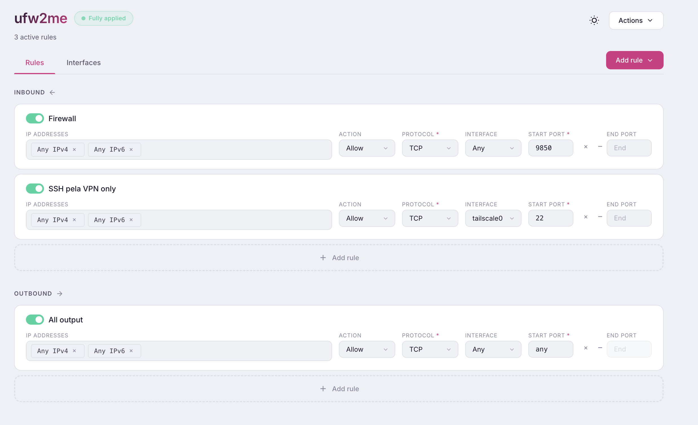
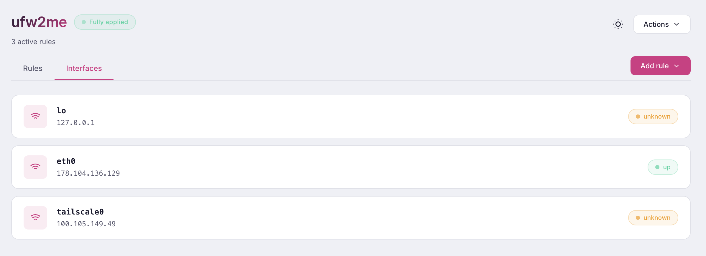

# ufw2me

ufw2me is a lightweight web UI for managing UFW (Uncomplicated Firewall) rules. It ships as a single Go binary that embeds the frontend assets and exposes a small HTTP API plus a Hetzner-inspired web interface.

Default port: `9850` (configurable).

## Screenshots

### Rules



### Interfaces



## Features

- View UFW status and rules
- Rules grouped into **INBOUND** and **OUTBOUND**
- Reorder rules (drag & drop) before applying
- Edit rule fields: description, IPs (tags), action (allow/deny/reject), protocol, ports (start/end), interface
- Explicit apply workflow: changes are only applied when you click **Save changes**
- Theme: dark / light / system

## System prerequisites

### Linux (production)

- UFW installed and usable (`ufw status` works)
- Root privileges (or a root-managed service) to run `ufw` commands
- systemd recommended (for managed service install)

Supported package managers by the installer: `apt-get`, `dnf`, `yum`, `pacman`.

### macOS / non-UFW environments (development)

UFW is typically not available. You can run the app in **mock mode** using `UFW2ME_DEV=1`, which returns sample status/rules and allows UI testing.

## Installation

There are two supported ways to install:

1. One-line installer (recommended for servers)
2. Manual build/run (recommended for development)

### 1) One-line installer (recommended)

From the project root you can run the local installer script:

```bash
sudo bash ./install.sh
```

What it does:

- Installs required tools if missing (`curl`, `git`, and `go`)
- Installs and enables UFW if needed
- Builds and installs `/usr/local/bin/ufw2me`
- Writes config file `/etc/ufw2me.env` (if missing)
- Creates and starts a systemd service `ufw2me.service` (when systemd is available)

To adapt this to the classic “curl | sudo bash” flow, host `install.sh` somewhere and use:

```bash
curl -fsSL https://raw.githubusercontent.com/ifernandosousa/ufw2me/main/install.sh | sudo bash
```

### 2) Manual build and run

#### Requirements

- Go 1.22+

#### Build

```bash
go build -o ufw2me .
```

#### Run (production)

Running in production mode requires UFW and typically needs root privileges:

```bash
sudo ./ufw2me
```

#### Run (mock/dev mode)

Mock mode does not call `ufw` and is suitable for development on machines without UFW:

```bash
UFW2ME_DEV=1 UFW2ME_PORT=9850 ./ufw2me
```

## Configuration

ufw2me reads configuration from:

1. Environment variables (highest priority)
2. `/etc/ufw2me.env` (if present)
3. `./ufw2me.env` (if present)

### Port settings

#### Default

- `UFW2ME_PORT=9850`

#### Configure via environment variable

```bash
UFW2ME_PORT=9000 sudo /usr/local/bin/ufw2me
```

#### Configure via `/etc/ufw2me.env` (recommended for servers)

Create or edit:

```bash
sudo nano /etc/ufw2me.env
```

Example:

```env
UFW2ME_PORT=9850
```

Then restart the service:

```bash
sudo systemctl restart ufw2me
```

#### Configure via `./ufw2me.env` (useful for local runs)

Create a file in the project directory:

```env
UFW2ME_PORT=9851
UFW2ME_DEV=1
```

Then run:

```bash
go run .
```

### Mock/dev mode

- `UFW2ME_DEV=1` enables mock mode for the backend UFW calls.

Example:

```bash
UFW2ME_DEV=1 UFW2ME_PORT=9851 go run .
```

## Service management (systemd)

If installed via `install.sh` on a systemd host, the service unit is:

- `/etc/systemd/system/ufw2me.service`

Common commands:

```bash
sudo systemctl status ufw2me
sudo systemctl restart ufw2me
sudo journalctl -u ufw2me -f
```

## Verification

### 1) Verify the HTTP server is up

```bash
curl -fsSL http://localhost:9850/api/status
```

Expected output includes:

- `"active": true|false`
- `"interfaces": [...]`

### 2) Verify rules API

```bash
curl -fsSL http://localhost:9850/api/rules
```

### 3) Verify in the browser

Open:

- `http://SERVER_IP:9850/`

### 4) Verify the service (systemd installs)

```bash
sudo systemctl is-active ufw2me
sudo systemctl status ufw2me --no-pager
```

## Dependency management

- Runtime dependencies are minimal: the app is a single binary plus the host’s `ufw`.
- Build-time dependency: Go 1.22+ (unless you distribute prebuilt binaries).

If you want a true “no-Go-on-server” install, adjust `install.sh` to download a prebuilt binary instead of building from source.

## Troubleshooting

### “ufw: command not found”

Install UFW:

- Debian/Ubuntu: `sudo apt-get install -y ufw`
- Fedora: `sudo dnf install -y ufw`
- Arch: `sudo pacman -Sy --noconfirm ufw`

Then enable it:

```bash
sudo ufw --force enable
```

### “permission denied” / UFW calls fail

Production mode needs privileges to run `ufw` commands.

- Run the binary with `sudo`, or
- Use systemd service (installed service runs as root by default)

### Port already in use

Change the port by setting `UFW2ME_PORT` and restart:

```bash
sudo sh -c 'echo "UFW2ME_PORT=9852" > /etc/ufw2me.env'
sudo systemctl restart ufw2me
```

### systemd not available

The installer will still install the binary, but won’t create a service. Run it manually:

```bash
sudo UFW2ME_PORT=9850 /usr/local/bin/ufw2me
```

For managed startup on non-systemd systems, use your init system (OpenRC, runit, etc.).

### UI loads but rules don’t apply

- Confirm UFW is active and usable: `sudo ufw status`
- Check service logs:

```bash
sudo journalctl -u ufw2me -n 200 --no-pager
```

### Developing on macOS

Use mock mode:

```bash
UFW2ME_DEV=1 UFW2ME_PORT=9851 go run .
open http://localhost:9851/
```

## Security notes

ufw2me executes firewall commands on the host. Treat it as an admin tool:

- Run behind trusted networks / VPN where possible
- Consider binding to localhost and using SSH tunneling or a reverse proxy with authentication
- Avoid exposing the port publicly without access controls
